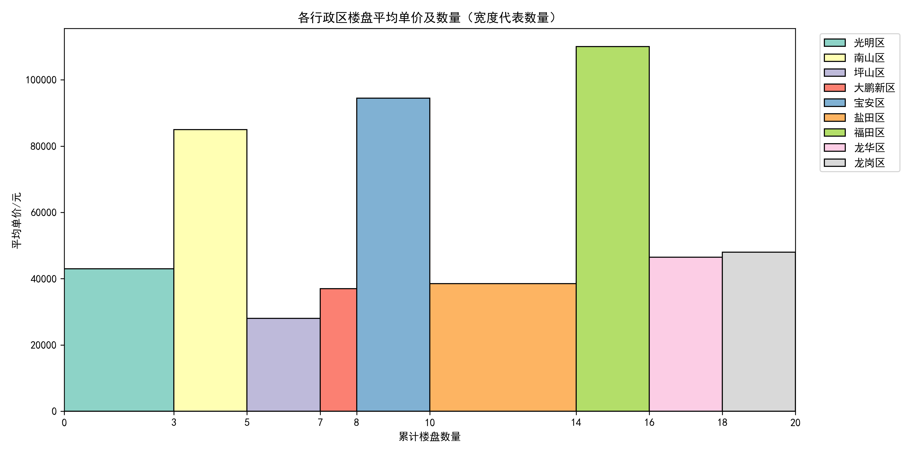
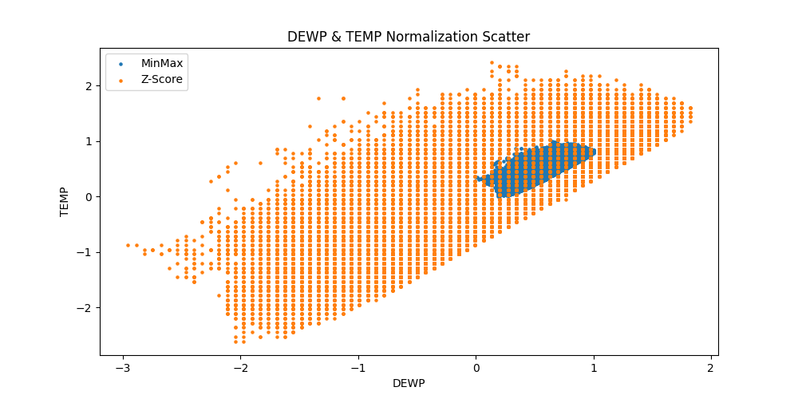

# python选修项目汇总

# 1.爬虫项目

由于链家网站在不登录的情况下无法查看3页之后的内容，在这里没有设置cookie

内容详见`first_scrapy`目录下

### 使用方法

进入目录后，使用scrapy打开：

```
cd first_scrapy
scrapy crawl new_house -o result.json
```

默认输出json文件

同时以下命令还可以选择**多种文件格式输出**：

json lines格式，默认为Unicode编码

```
scrapy crawl itcast -o teachers.jsonl
```

csv 逗号表达式，可用Excel打开

```
scrapy crawl itcast -o teachers.csv
```

xml格式

```
scrapy crawl itcast -o teachers.xml
```

# 2.数据可视化处理

1.详见`Data_process1`目录



2.详见`Data_process2`目录


